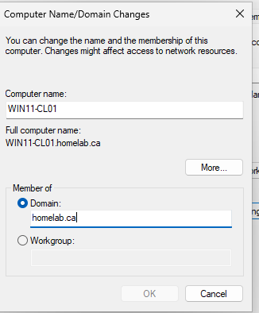
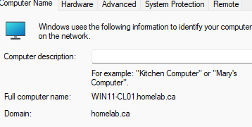
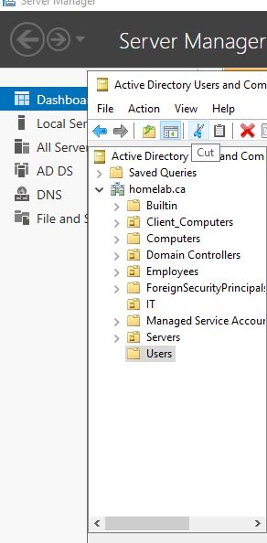
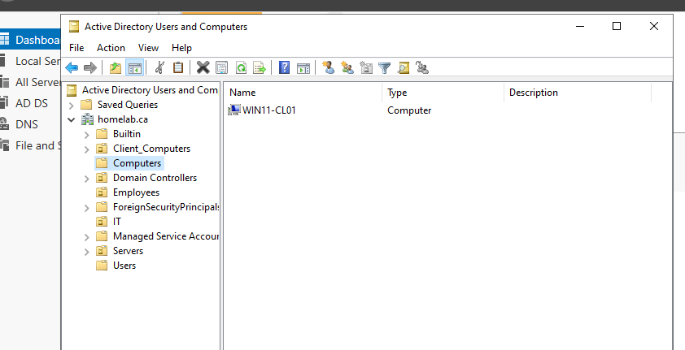
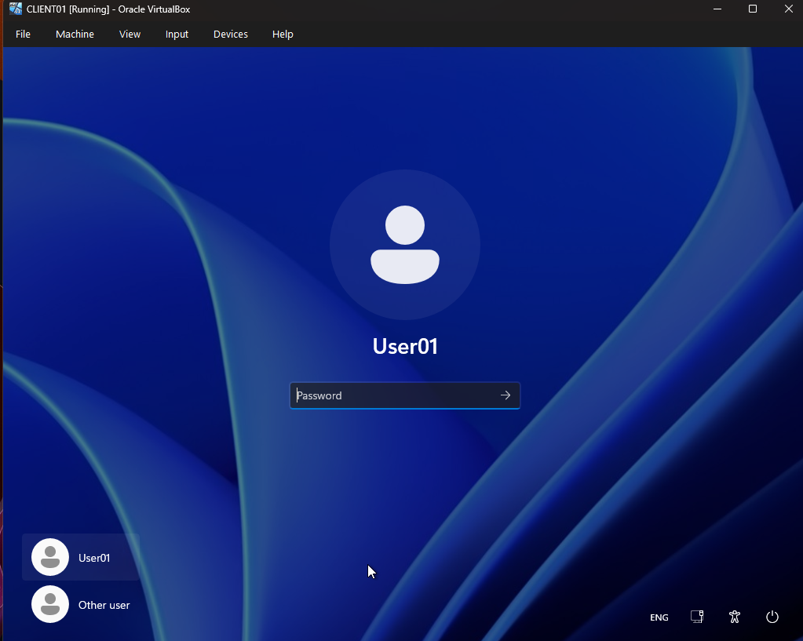

# 03 - Successfully Joined a Windows Client to My Active Directory Domain

Today I continued working on my Active Directory home lab by setting up a client machine and testing domain authentication.

---

## Client Configuration

I created a Windows client VM (CL01) in VirtualBox and configured the network settings.

- Set the DNS server to the Windows Server (DC01) IP address  
- Ensured the client machine could communicate with the domain  

This step is important because Active Directory relies on DNS for proper communication.

---

## Domain Join

I joined the client machine to my domain:

homelab.ca

The client system was configured to join the domain (WIN11-CL01 → homelab.ca).

After restarting the system, the domain join was successfully completed.

The system now shows:
- Full computer name: WIN11-CL01.homelab.ca  
- Domain: homelab.ca  

This confirms that the client is now part of the domain.

---

## Active Directory Structure

Using Active Directory Users and Computers, I created Organizational Units to organize the environment.

- Employees → John Smit  
- Computers → CL01  
- Users → USER01  

This structure helps manage users and computers more efficiently.

---

## Verification

After joining the client machine to the domain, the computer **WIN11-CL01** appeared in Active Directory.

I also tested authentication by logging into the client machine using a domain account.

This confirmed that:
- The Domain Controller is working  
- DNS is correctly configured  
- Authentication across machines is successful  

---

## Reflection

It's interesting to see how user authentication works across machines in a domain environment. Slowly building this lab is helping me understand how things operate in real IT infrastructures.
