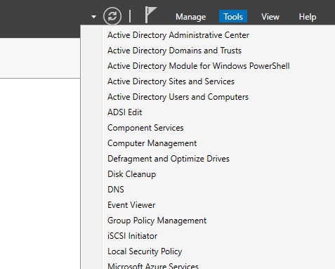
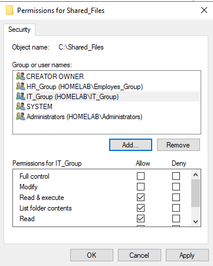
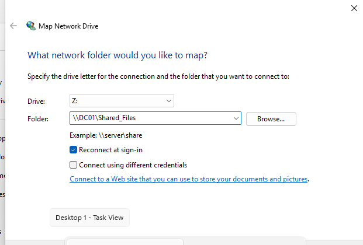
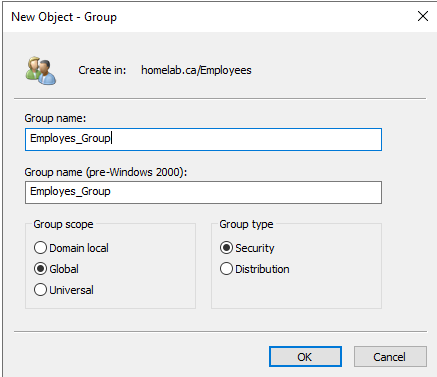
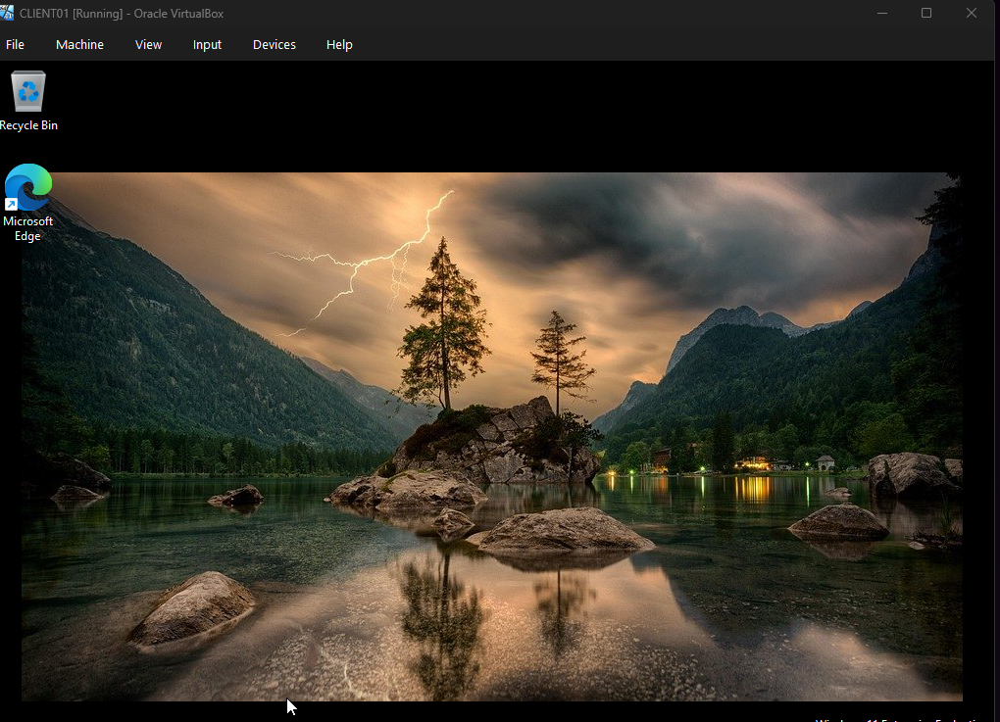
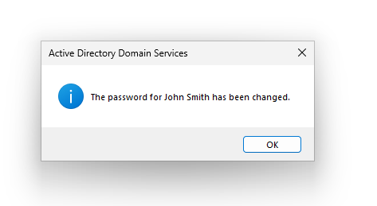
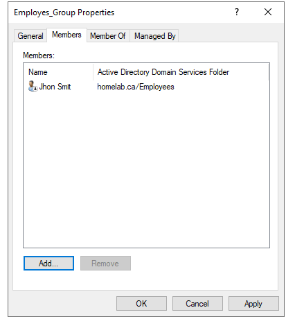
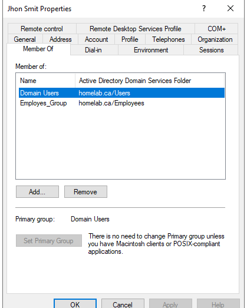

# 04 - Creating Security Groups in Active Directory

In this lab, I continued building my Active Directory home lab by creating **Security Groups** and assigning users to them. This is an important part of identity and access management in a Windows domain environment because it allows administrators to assign permissions to groups instead of managing access user by user.

---

## Objective

The goal of this lab was to:

- Create Security Groups in Active Directory
- Organize those groups inside the correct Organizational Units (OUs)
- Add users to the appropriate groups
- Verify group membership from both the group side and the user side

This simulates how access control is managed in real IT environments.

---

## Environment

- **Hypervisor:** VirtualBox
- **Server OS:** Windows Server
- **Domain:** `homelab.ca`
- **Tool Used:** Active Directory Users and Computers (ADUC)

---

## Why Security Groups Matter

In Active Directory, Security Groups are used to simplify access management.

Instead of assigning permissions directly to individual users, administrators assign permissions to a group, then add users to that group.

For example:

- `Employees_Group` can later be granted access to shared folders
- Any user added to `Employees_Group` will automatically inherit that access

This makes administration:

- more scalable
- easier to manage
- less prone to human error

---

## Step 1 - Open Active Directory Users and Computers

From **Server Manager**, I opened the **Tools** menu and launched **Active Directory Users and Computers**.

This is the main console used to manage users, groups, computers, and Organizational Units in the domain.

---

## Step 2 - Review the Domain Structure

Inside ADUC, I reviewed the current Active Directory structure for the `homelab.ca` domain.

At this stage, I already had several Organizational Units created, including:

- `Employees`
- `IT`
- `Servers`
- `Client_Computers`

This structure helps keep the environment organized and reflects how departments or resources are separated in a real business network.

---

## Step 3 - Begin Creating a Security Group

To create a new group, I right-clicked the appropriate Organizational Unit and selected:

**New > Group**

For the IT department, I created the group inside the `IT` OU.

---

## Step 4 - Create the IT Security Group

I created a new group with the following configuration:

- **Group name:** `IT_Group`
- **Group scope:** Global
- **Group type:** Security

This group is intended to represent IT-related users and can later be used to assign permissions to administrative resources.

---

## Step 5 - Create the Employees Security Group

Next, I created another Security Group inside the `Employees` OU.

Configuration used:

- **Group name:** `Employees_Group`
- **Group scope:** Global
- **Group type:** Security

This group will be used for standard employee accounts and can later be assigned access to shared resources such as folders or mapped drives.

---

## Step 6 - Verify the Group Appears in the Employees OU

After creating the group, I confirmed that `Employees_Group` appeared inside the `Employees` OU alongside the user account `John Smit`.

This shows that the Organizational Unit now contains both the user object and the Security Group used to manage that user’s future permissions.

---

## Step 7 - Add a User to the Security Group

I then opened the properties of `Employees_Group` and used the **Members** tab to add a user.

I selected:

- **User:** `John Smit`

This step establishes the relationship between the user account and the group.

---

## Step 8 - Verify Group Membership from the Group Side

After adding the user, I confirmed that `John Smit` appears under the **Members** tab of `Employees_Group`.

This verifies that the group contains the correct user.

---

## Step 9 - Verify Membership from the User Side

Finally, I opened the properties of the user account `John Smit` and checked the **Member Of** tab.

I confirmed that the user belongs to:

- `Domain Users`
- `Employees_Group`

`Domain Users` is the default group for domain accounts, while `Employees_Group` is the custom Security Group I created during this lab.

This is an important verification step because it confirms the membership from the user’s perspective.

---

## Result

At the end of this lab, I successfully:

- Created Security Groups in Active Directory
- Organized groups inside the correct OUs
- Added a user to the appropriate Security Group
- Verified group membership from both the group and user views

This is a foundational Active Directory skill because group-based access control is widely used in enterprise environments to manage permissions efficiently.

---

## Key Takeaways

- Security Groups are used to manage access more efficiently than assigning permissions directly to users
- Organizational Units help keep the domain structured and manageable
- Group membership should always be verified after configuration
- The **Members** tab and **Member Of** tab provide two different ways to confirm membership

---

## Next Steps

The next step in this home lab is to use these Security Groups for real access control scenarios, such as:

- creating a shared network folder
- assigning NTFS and share permissions
- mapping a network drive for users
- applying Group Policy Objects (GPOs)

---

## Skills Practiced

- Active Directory Users and Computers
- Security Group creation
- User-to-group assignment
- Organizational Unit management
- Access control fundamentals
- Windows Server administration

---
