# 🧪 Active Directory Homelab (Windows Server 2022)

  
  
  
  

---

## 📌 0. Table of Contents

- [1. Project Overview](#1-project-overview)
- [2. Lab Architecture](#2-lab-architecture)
- [3. Windows Server Installation & Troubleshooting](#3-windows-server-installation--troubleshooting)
- [4. Domain Controller Setup (DC01)](#4-domain-controller-setup-dc01)
- [5. Client Setup & Domain Join](#5-client-setup--domain-join)
- [6. Security Groups & Access Control](#6-security-groups--access-control)
- [7. Delegation of Control (Password Reset)](#7-delegation-of-control-password-reset)
- [8. Key Skills Demonstrated](#8-key-skills-demonstrated)
- [9. Future Improvements](#9-future-improvements)
- [10. Why This Project Matters](#10-why-this-project-matters)

---

## 📌 1. Project Overview

This project documents my hands-on experience building an **Active Directory home lab** using **Windows Server 2022** and **VirtualBox**.

The lab simulates a real-world IT environment and focuses on:

- System administration  
- Active Directory management  
- User and access control  
- Troubleshooting  

---

## 🏗️ 2. Lab Architecture
DC01 (Domain Controller)
│
├── Active Directory (homelab.ca)
├── DNS Server
│
└── Client Machine
└── WIN11-CL01 (Domain Joined)

---

## ⚙️ 3. Windows Server Installation & Troubleshooting

### ❌ Issue Encountered

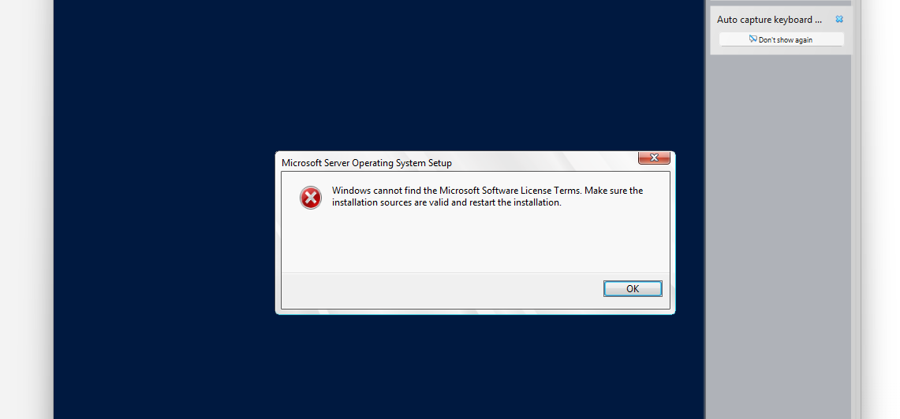

**Figure 1:** License error during installation

---

### 🔍 Troubleshooting

- Checked virtualization settings  
- Adjusted VM resources  
- Reviewed system security  

---

### 🧠 Root Cause

VirtualBox **Unattended Installation** caused the failure.

---

### ✅ Resolution

- Recreated VM  
- Disabled unattended setup  

---

### ✔️ Result

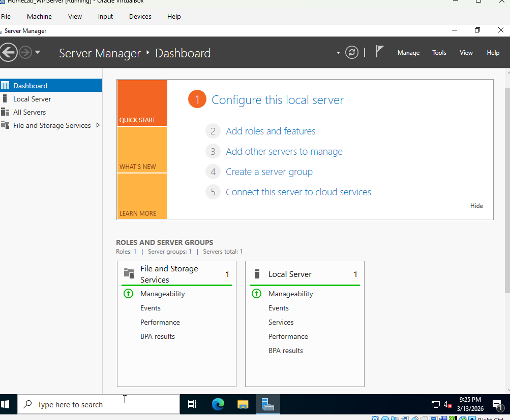

**Figure 2:** Successful installation

---

## 🏢 4. Domain Controller Setup (DC01)

### ⚙️ Configuration

- Installed AD DS  
- Installed DNS  
- Promoted to Domain Controller  
- Created domain: `homelab.ca`  

---

### 🔐 Verification

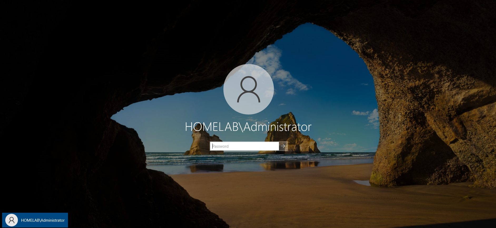

**Figure 3:** Domain login success  

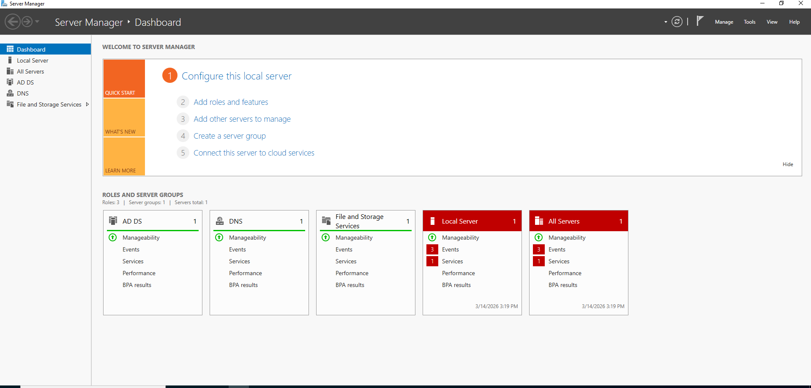

**Figure 4:** Services running  

---

## 💻 5. Client Setup & Domain Join

### 🔗 Domain Join

---

### 🗂️ OU Structure

---

### ✔️ Verification

---

## 🔐 6. Security Groups & Access Control

### 🛠️ Steps

1. Open ADUC  

2. Review structure  
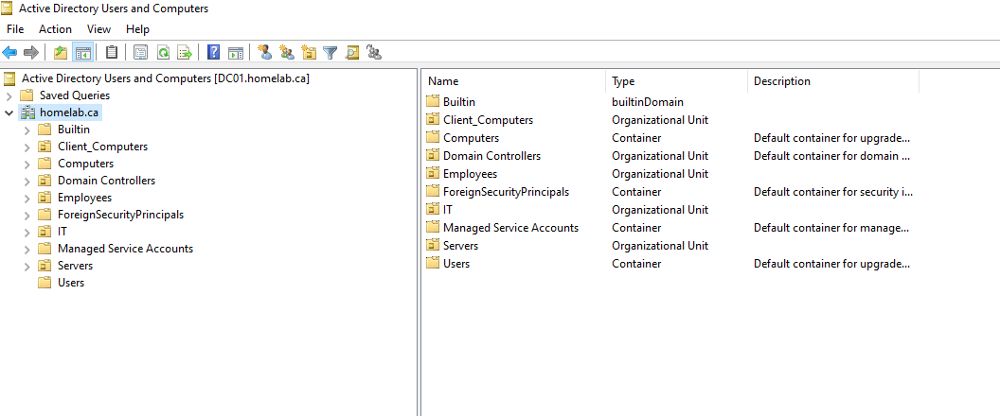

3. Create group  
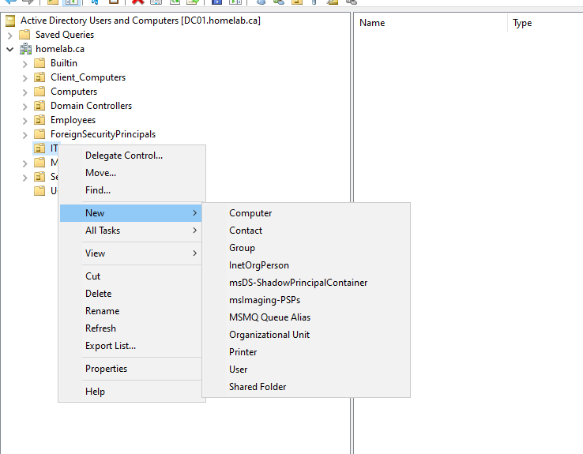

4. IT group  
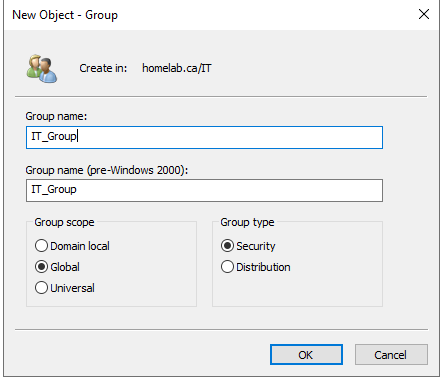

5. Employees group  

6. Verify OU  
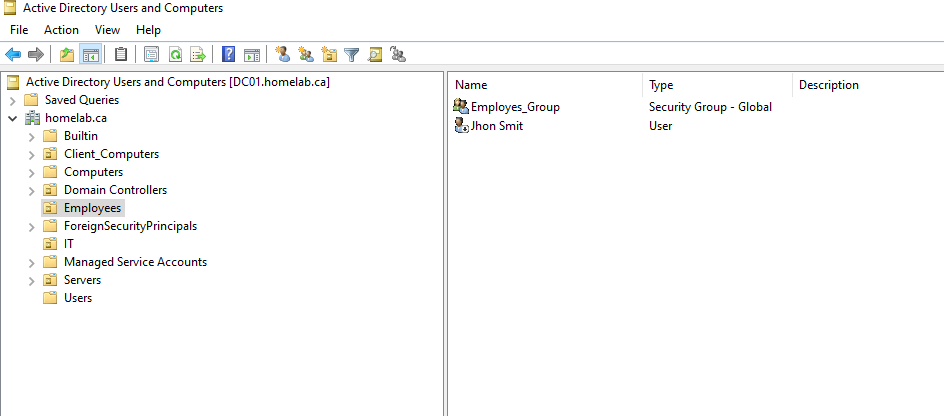

7. Add user  
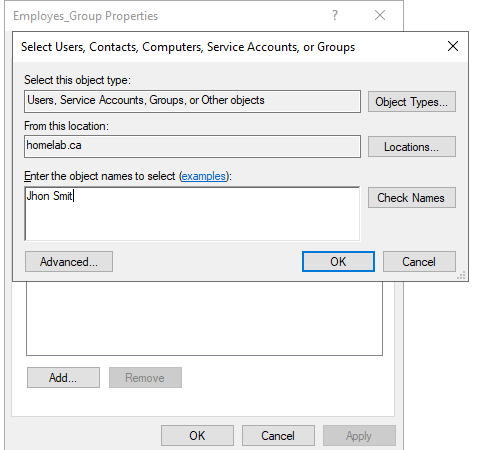

8. Verify members  
  
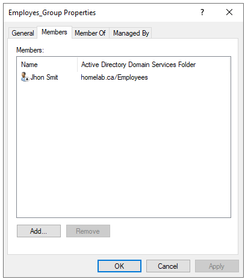

9. User side verification  

---

## 🔐 7. Delegation of Control (Password Reset)

### 🎯 Objective

Enable IT support to reset passwords without admin privileges.

---

### 🛠️ Steps

1. Start delegation  
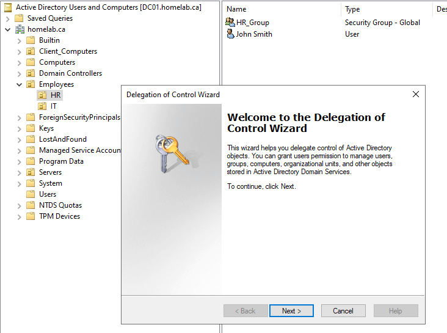

2. Select IT_Group  
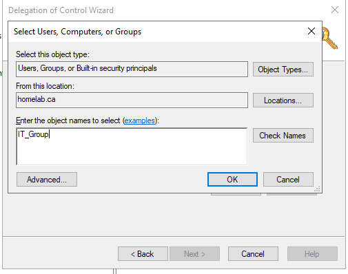

3. Assign permissions  
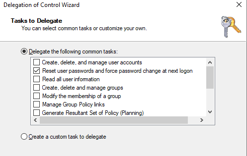

---

### 💻 Verification

4. Reset password  
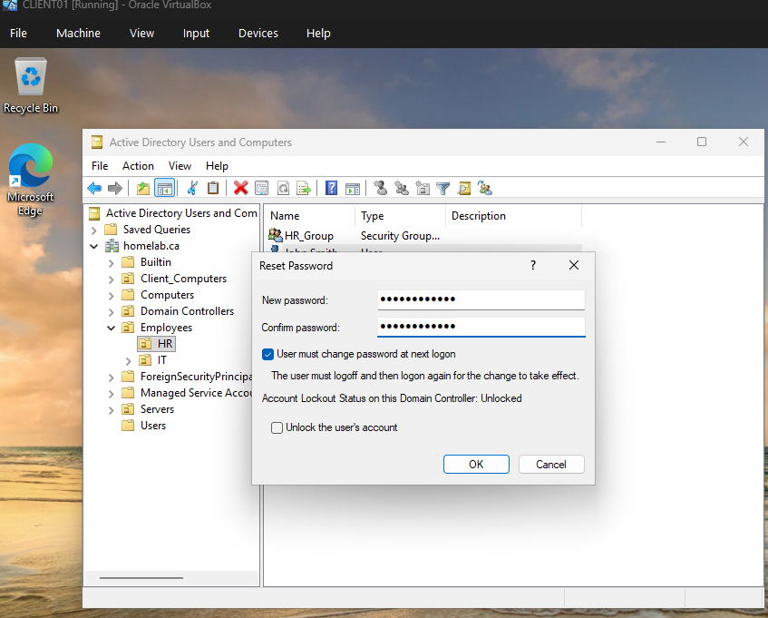

5. Success confirmation  

---

### 🔍 Validation

- Password reset allowed  
- Other actions restricted  

---

### 📊 Supporting Evidence

  
  

---

## 🧠 8. Key Skills Demonstrated

- Active Directory Administration  
- Windows Server Management  
- DNS Configuration  
- User & Group Management  
- Access Control (RBAC)  
- Troubleshooting  

---

## 🚀 9. Future Improvements

- Group Policy (GPO)  
- Shared folders & permissions  
- Auditing & logging  
- Security monitoring  

---

## 💡 10. Why This Project Matters

This lab reflects real IT support responsibilities:

- Domain setup  
- Authentication  
- Access control  
- Troubleshooting  
