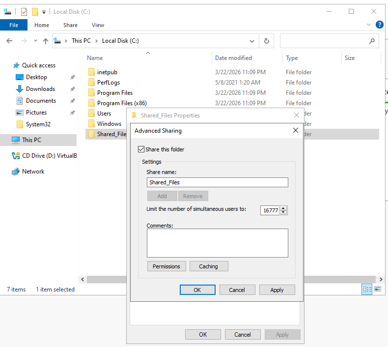
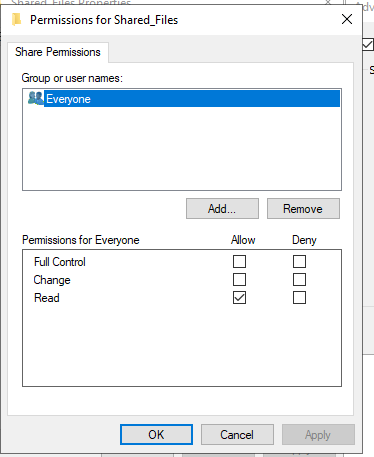
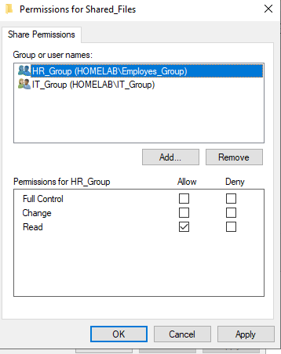
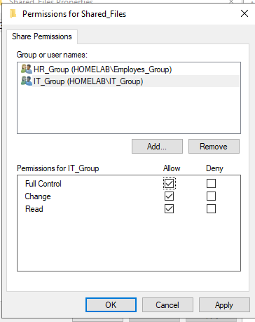
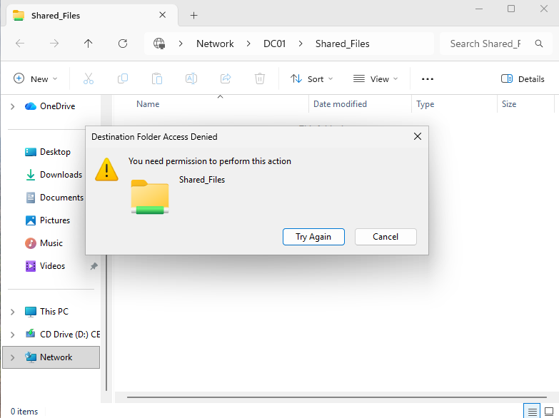
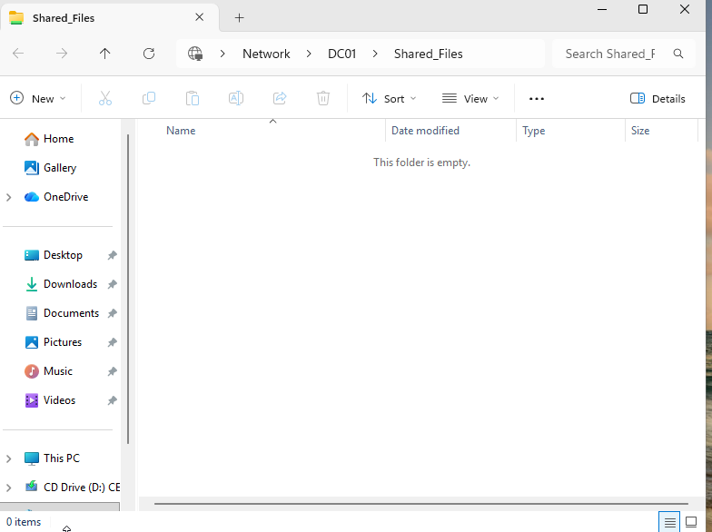
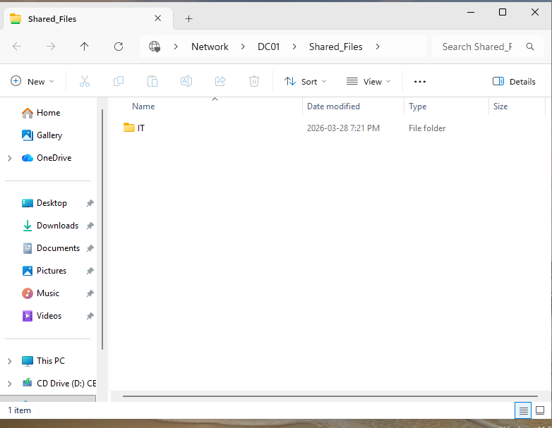
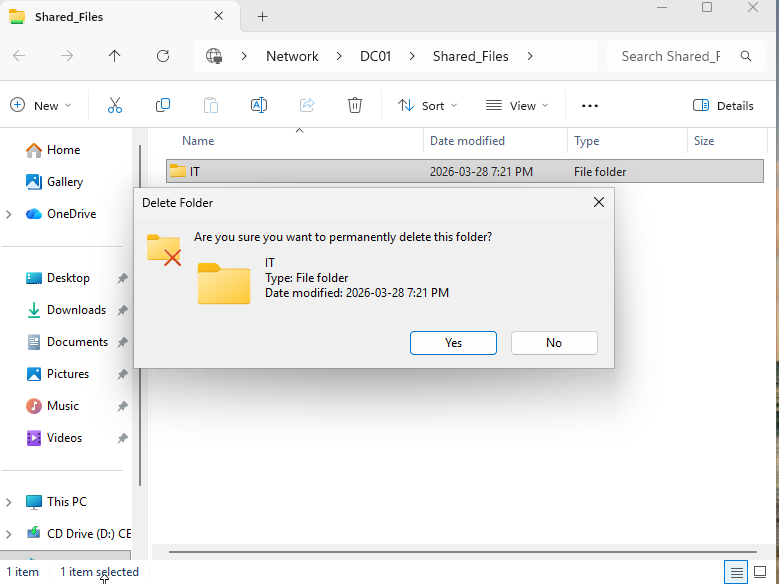

#  - Shared Folder & Permissions (NTFS + Share)

## 📖 Overview

In this lab, I created a shared network folder on a Windows Server and configured both **Share Permissions** and **NTFS Permissions** using Active Directory security groups.

The goal was to simulate a real-world file server where access is controlled based on user roles.

---

## 🧱 Environment

* **Domain Controller:** DC01 (Windows Server 2022)
* **Client Machine:** CL01 (Windows 11)
* **Domain:** homelab.ca
* **Security Groups:** HR_Group, IT_Group

---

## 🎯 Objective

* Create a shared folder on the server
* Configure Share permissions
* Configure NTFS permissions
* Enforce role-based access control
* Validate access from client machine

---

## 📁 Step 1 - Created Shared Folder

A shared folder was created on the server:

```bash
C:\Shared_Files
```
This folder acts as a centralized location for domain users.

---

## 🌐 Step 2 - Configured Share Permissions

The folder was shared using **Advanced Sharing**.



---





---



---

### Configuration:

* Removed default **Everyone** access  
* Added:

  * **HR_Group** → Read  
  * **IT_Group** → Full Control  

This ensures controlled access over the network.

---

## 🔐 Step 3 - Configured NTFS Permissions

NTFS permissions were configured via the **Security tab**.

### Key Actions:

* Disabled inheritance
* Converted inherited permissions to explicit
* Removed **Users** group
* Added:

  * **HR_Group** → Read & Execute
  * **IT_Group** → Modify

### ⚠️ Important Concept

> Final access is determined by the most restrictive combination of **Share and NTFS permissions**

---

## 🧪 Step 4 - Access Testing

Access was tested from the client machine using different user roles.

---

### 👤 HR User Test (John Smith)



* Attempted to modify/delete content
* ❌ Access Denied

✔ Confirms read-only access for HR users

---
### 👤 IT Admin - Folder Access



* Successfully accessed the shared folder
* ✔ No restrictions

---

### 📁 IT Admin - Create Folder



* Created a folder inside the share
* ✔ Allowed

---

### 🗑 IT Admin - Delete Folder




* Deleted the folder successfully
* ✔ Allowed

---

## 📂 Screenshot Structure

---

## 🎯 Results

| User     | Action        | Result    |
| -------- | ------------- | --------- |
| HR User  | Modify/Delete | ❌ Denied  |
| IT Admin | Create File   | ✅ Allowed |
| IT Admin | Delete File   | ✅ Allowed |

---

## 🧠 Key Concepts

* NTFS vs Share Permissions
* Permission Inheritance
* Role-Based Access Control (RBAC)
* Least Privilege Principle

---

## 💼 Skills Demonstrated

* Active Directory group-based access control
* File server configuration in Windows Server
* NTFS and Share permission management
* Access validation and troubleshooting

---

## 🚀 Conclusion

This lab demonstrates how to securely configure shared resources in an Active Directory environment using group-based permissions. The implementation follows real-world best practices for access control and user management.

---

