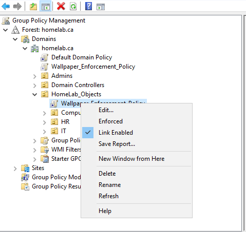
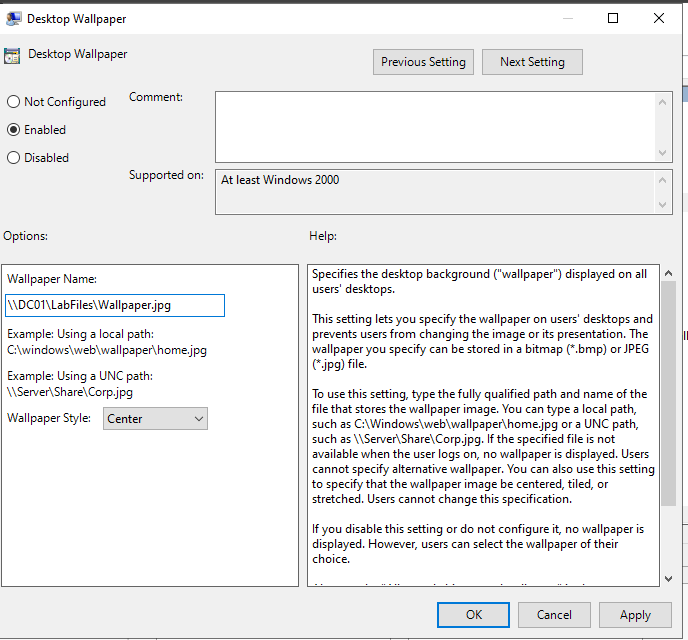
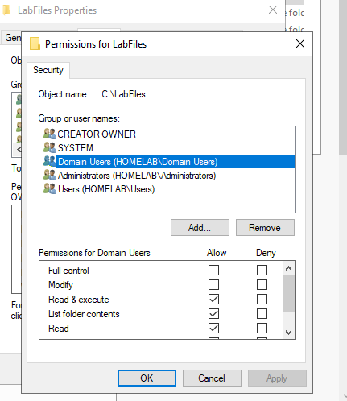

# 🖥️ Windows Server 2022: Domain-Wide Wallpaper Deployment via GPO

## Project Overview
This repository documents the implementation of a centralized desktop management strategy within a Windows Server 2022 environment. I successfully automated the deployment of a standardized corporate wallpaper across the `homelab.ca` domain, specifically targeting the `HomeLab_Objects` Organizational Unit (OU).

## 🛠️ Environment Details

| Component | Configuration |
| :--- | :--- |
| **Domain Name** | `homelab.ca` |
| **Server OS** | Windows Server 2022 |
| **Client OS** | Windows 11 (`CLIENT01`) |
| **Policy Name** | `Wallpaper_Enforcement_Policy` |

## 🚀 Technical Steps

### 1. Active Directory Setup
I organized the domain into specific OUs to ensure the policy only affected the intended users without disrupting the entire forest.

### 2. UNC Pathing & Networking
Because GPOs cannot access local `C:\` paths on remote client machines, I hosted the wallpaper on a network share:
* **Server Path:** `\\DC01\LabFiles\Wallpaper.jpg`

### 3. Resolving the "Black Screen" Issue (Permissions)
The most critical part of this lab was fixing the common "Black Screen" error where the policy applies but the image fails to load. This was resolved by adjusting the **NTFS Security Permissions**:

* **Action:** Added the `Domain Users` group to the `LabFiles` folder permissions.
* **Result:** Client machines gained the "Read" access necessary to pull the image file during the login process.

## 📈 Final Result
After running `gpupdate /force` on the client, the Windows 11 desktop successfully updated to the domain-enforced wallpaper.

---
