# 09 — DHCP Server

## Objective

Deploy and configure a DHCP server on DC01 to automatically assign IP addresses, DNS server, default gateway, and domain suffix to client machines joining the `homelab.ca` domain. This eliminates manual IP configuration for new clients.

---

## Environment

| Machine | Role | IP Address |
|---|---|---|
| DC01 | Domain Controller + DHCP Server | 192.168.10.1 (static) |
| CL01 | Existing domain client | Static IP (unchanged) |
| CLIENT02 | New test client | 192.168.10.100 (DHCP assigned) |

> **Note:** CL01 was kept on a static IP as a known-good baseline. CLIENT02 was used to test and verify DHCP functionality.

---

## Step 1 — Install DHCP Server Role

On DC01, opened Server Manager → Add Roles and Features → selected **DHCP Server** role on DC01.homelab.ca.

<!-- Picture 1 -->
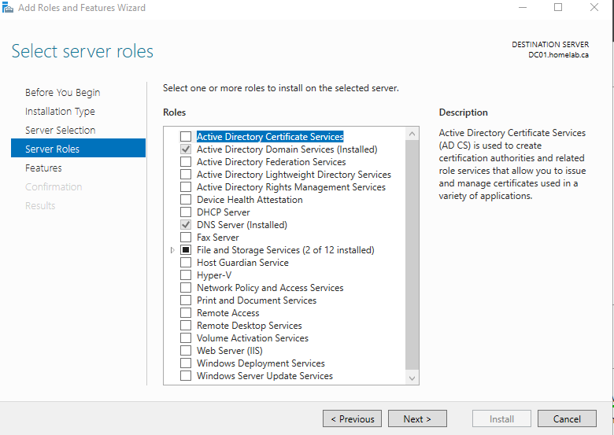

Installation completed successfully with DHCP Server and DHCP Server Tools installed.

<!-- Picture 3 -->
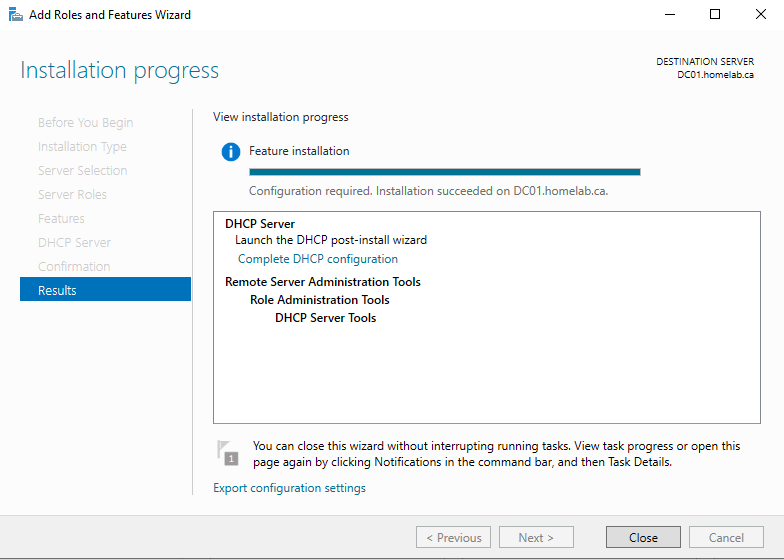

---

## Step 2 — Authorise DHCP in Active Directory

After installation, clicked **Complete DHCP configuration** to launch the post-install wizard. Used `HOMELAB\Administrator` credentials to authorise DC01 as a DHCP server in AD DS.

<!-- Picture 4 -->
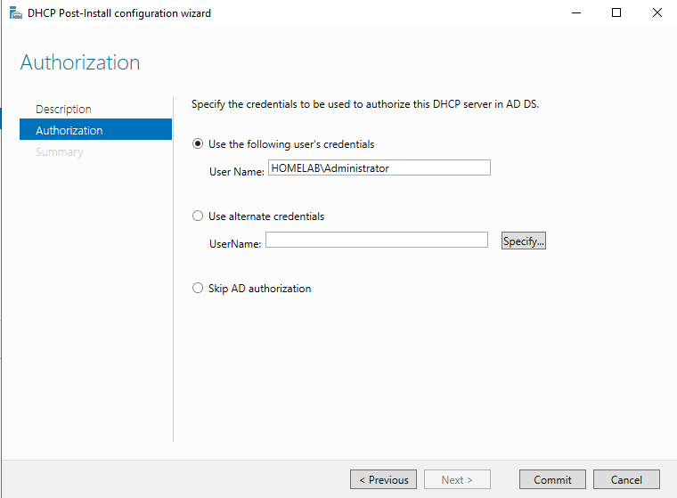

Both post-install steps completed successfully.

<!-- Picture 5 -->
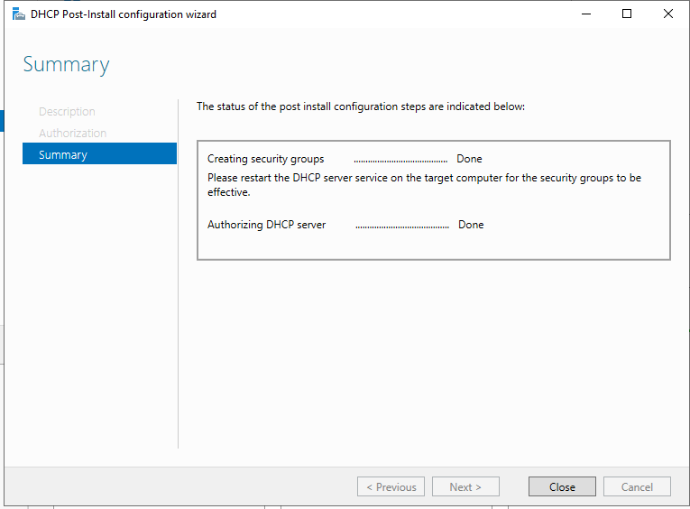

Restarted the DHCP service via PowerShell to apply the new security groups:

```powershell
Restart-Service dhcpserver
```

<!-- Picture 6 -->
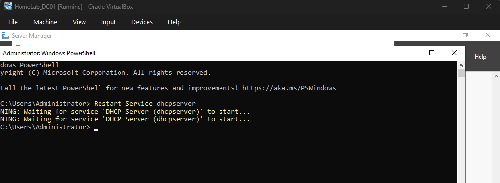

---

## Step 3 — Create DHCP Scope

Opened DHCP console: Server Manager → Tools → DHCP. Expanded `dc01.homelab.ca` → right-clicked **IPv4** → **New Scope**.

<!-- Picture 8 -->
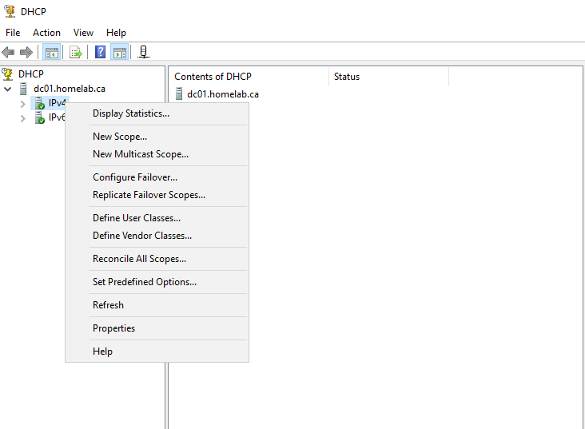

Named the scope `homelab-scope` with description `homelab.ca DHCP scope`.

<!-- Picture 9 -->
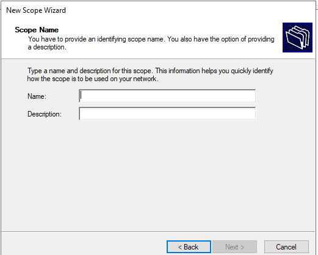

Configured the IP address range:

| Setting | Value |
|---|---|
| Start IP | 192.168.10.100 |
| End IP | 192.168.10.200 |
| Subnet Mask | 255.255.255.0 (/24) |

> DC01's static IP (192.168.10.1) sits below the scope range so no exclusion was needed.

<!-- Picture 10 -->
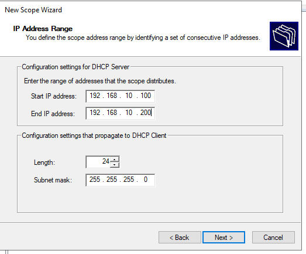

Set lease duration to **8 days** — appropriate for stable lab VMs.

<!-- Picture 11 -->
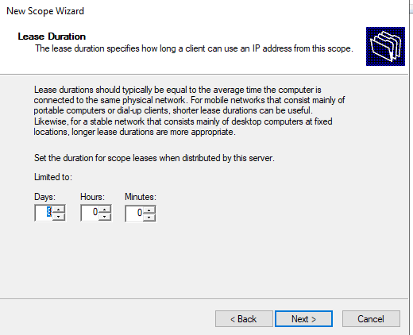

---

## Step 4 — Configure DHCP Options

Set **Option 003 — Router (Default Gateway)** to `192.168.10.1` (DC01).

<!-- Picture 12 -->
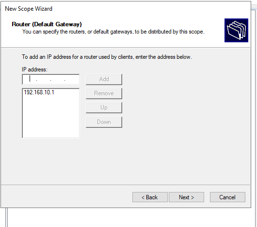

DNS server and domain name were auto-populated correctly:
- **Option 006 — DNS Server:** `192.168.10.1` (DC01)
- **Option 015 — DNS Domain:** `homelab.ca`

> Option 006 is the critical setting — it tells every DHCP client to use DC01 as its DNS server, which keeps domain authentication and GPO working automatically.

Activated the scope immediately.

---

## Step 5 — Verify with CLIENT02

Created a fresh Windows 11 Enterprise VM (CLIENT02) in VirtualBox with the network adapter set to Internal Network `intnet` — the same network as DC01.

CLIENT02 booted and received its IP automatically via DHCP with no manual configuration. Verified with `ipconfig /all`:

<!-- Picture 13 -->
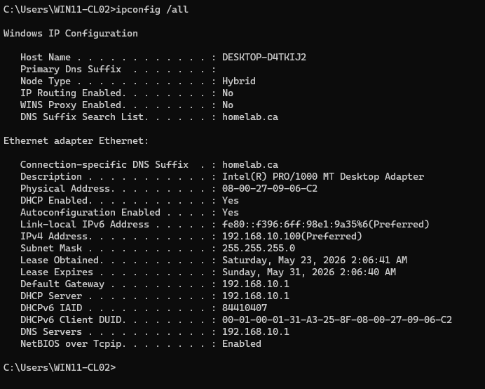

**Confirmed:**
- DHCP Enabled: **Yes**
- IPv4 Address: **192.168.10.100** (first IP in scope)
- DHCP Server: **192.168.10.1** (DC01)
- DNS Servers: **192.168.10.1** (DC01)
- DNS Suffix: **homelab.ca**
- Lease Obtained: Saturday, May 23, 2026
- Lease Expires: Sunday, May 31, 2026 (8-day lease)

DC01's DHCP console confirms the lease was handed out to WIN11-CL02:

<!-- Picture 14 -->
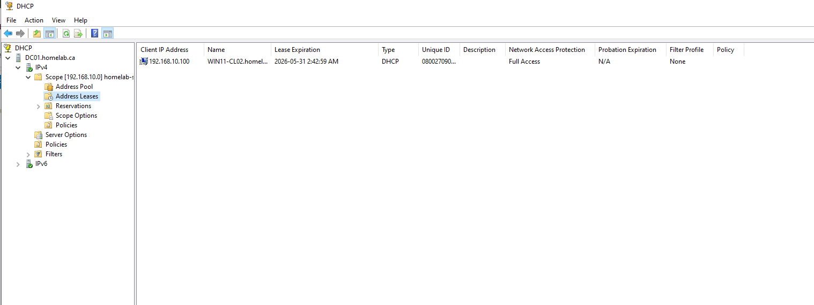

CLIENT02 was then successfully joined to the `homelab.ca` domain using `HOMELAB\Administrator` credentials, confirming that DHCP correctly delivered the DNS settings needed for domain authentication.

---

## How DHCP Works — DORA Process

When CLIENT02 booted with no IP address, the following exchange happened automatically:

| Step | Who | Action |
|---|---|---|
| **Discover** | CLIENT02 | Broadcasts to network: *"Is there a DHCP server?"* |
| **Offer** | DC01 | Responds: *"I'll offer you 192.168.10.100"* |
| **Request** | CLIENT02 | Replies: *"I'll take that IP"* |
| **Acknowledge** | DC01 | Confirms: *"It's yours for 8 days — here's your DNS and gateway too"* |

---

## Before vs After

| | CL01 (before DHCP) | CLIENT02 (after DHCP) |
|---|---|---|
| IP assignment | Manual (static) | Automatic (DHCP) |
| DNS server | Manually configured | Delivered via Option 006 |
| Domain suffix | Manually configured | Delivered via Option 015 |
| Setup time | ~5 minutes per machine | Zero — automatic on boot |

---

## Key Learnings

- DHCP must be **authorised in Active Directory** before it will hand out leases — an unauthorised DHCP server is silently blocked
- **Option 006 (DNS)** must point to DC01, not external DNS like 8.8.8.8 — external DNS breaks domain join and GPO because it cannot resolve `homelab.ca`
- **Static IPs** (DC01, future DC02) sit below the scope range (.1–.99) so DHCP never conflicts with them
- **Servers always use static IPs** — only client machines use DHCP. Standard practice in all enterprise environments

---

## Next Module

[Module 10 — DC02 Second Domain Controller and AD Replication](../10-dc02-replication/)
