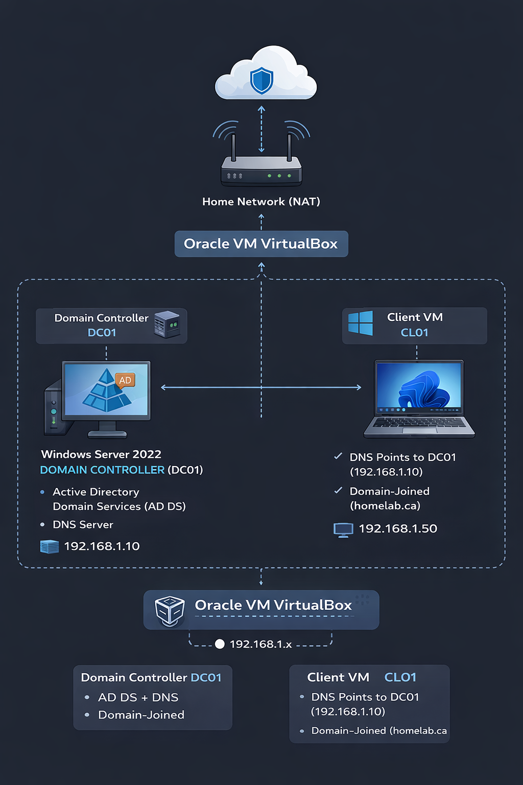

# 🧪 Active Directory Home Lab (Windows Server 2022)

<p align="center">
  
  
  
  
</p>

---

## 📌 Project Overview

This project demonstrates the deployment and management of a **Windows Server 2022 Active Directory environment** using **Oracle VM VirtualBox**.

The lab simulates a real-world enterprise network, focusing on:

* Identity & Access Management (IAM)
* Role-Based Access Control (RBAC)
* Group Policy Management (GPO)
* File Server Configuration
* Network Drive Mapping
* Troubleshooting & System Administration

📌 Built as hands-on experience for **IT Support / Help Desk / System Administrator roles**

---

## 🧭 Table of Contents

* [🏗️ Lab Architecture](#-lab-architecture)
* [📂 Project Structure](#-project-structure)
* [🚀 Lab Modules](#-lab-modules)
* [🧠 Key Concepts](#-key-concepts-demonstrated)
* [💼 Skills Demonstrated](#-skills-demonstrated)
* [🎯 Outcome](#-outcome)
* [🔮 Future Improvements](#-future-improvements)

---

## 🏗️ Lab Architecture

<p align="center">
  
</p>

<p align="center"><b>Figure:</b> Active Directory Home Lab Architecture</p>

<br>

This diagram represents the overall structure of my Active Directory home lab environment built using VirtualBox.

- **Oracle VM VirtualBox**
  - Acts as the virtualization platform hosting all machines

- **Domain Controller (DC01)**
  - Runs Windows Server 2022  
  - Hosts:
    - Active Directory Domain Services (AD DS)
    - DNS Server  
  - IP Address: `192.168.X.X`  
  - Responsible for authentication and domain services  

- **Client Machine (CL01)**
  - Windows 10/11 virtual machine  
  - Domain-joined to `homelab.ca`  
  - Uses DC01 as its DNS server  
  - IP Address: `192.168.X.X`  

- **Networking (VirtualBox NAT / Internal Network)**
  - Enables communication between machines  
  - Handles authentication, GPO, and file access  

---

### 🧠 Key Concept

👉 The **client must point to DC01 for DNS**

Without this:
- Domain join ❌ fails  
- Login ❌ fails  
- GPO ❌ won’t apply  

---


| Component         | Details                    |
| ----------------- | -------------------------- |
| Hypervisor        | Oracle VM VirtualBox       |
| Domain Controller | DC01 (Windows Server 2022) |
| Client Machine    | CL01 (Windows 10/11)       |
| Domain            | `homelab.ca`               |
| Services          | Active Directory, DNS      |
| Tools             | ADUC, GPMC, RSAT           |

---

## 📂 Project Structure

```bash
active-directory-homelab/
│
├── 01-windows-server-installation
├── 02-domain-controller-setup
├── 03-client-domain-join
├── 04-security-groups-and-access-control
├── 05-delegation-of-control
├── 06-shared-folder-permissions
├── 07-mapping-network-drives-&-permission-testing
├── 08-deploying-a-domain-wide-wallpaper
│
├── screenshots/
└── README.md
```

---

## 🚀 Lab Modules

### 🔹 [01 - Windows Server Installation](./01-windows-server-installation)

* Installed Windows Server 2022 on VirtualBox
* Troubleshot installation error (Unattended Installation issue)
* Completed successful deployment

---

### 🔹 [02 - Domain Controller Setup](./02-domain-controller-setup)

* Installed AD DS & DNS
* Promoted server to Domain Controller
* Created forest: `homelab.ca`

---

### 🔹 [03 - Client Domain Join](./03-client-domain-join)

* Configured DNS to point to DC01
* Joined Windows client to domain
* Verified domain authentication

---

### 🔹 [04 - Security Groups & Access Control](./04-security-groups-and-access-control)

* Created Security Groups (IT_Group, Employees_Group)
* Assigned users to groups
* Verified membership (Group & User level)

---

### 🔹 [05 - Delegation of Control](./05-delegation-of-control)

* Delegated password reset permissions
* Implemented Least Privilege model
* Used RSAT for remote administration

---

### 🔹 [06 - Shared Folder Permissions](./06-shared-folder-permissions)

* Configured NTFS & Share Permissions
* Implemented group-based access control
* Managed inheritance & security

---

### 🔹 [07 - Network Drive Mapping](./07-mapping-network-drives-&-permission-testing)

* Mapped shared folder as Z: drive
* Tested access using multiple users
* Validated RBAC enforcement

---

### 🔹 [08 - GPO Deployment (Wallpaper)](./08-deploying-a-domain-wide-wallpaper)

* Deployed domain-wide wallpaper via GPO
* Used UNC path for centralized access
* Fixed NTFS permission issue (black screen bug)

---

## 🧠 Key Concepts Demonstrated

* Active Directory Domain Services (AD DS)
* DNS Configuration in Enterprise Networks
* Organizational Units (OUs)
* Security Groups & RBAC
* NTFS vs Share Permissions
* Group Policy Objects (GPO)
* Network Drive Mapping
* Client-Server Communication

---

## 💼 Skills Demonstrated

* Windows Server Administration
* Active Directory Management
* User & Group Administration
* Access Control Implementation
* Troubleshooting & Root Cause Analysis
* Virtualization (VirtualBox)
* Documentation & IT Workflow

---

## 🎯 Outcome

✔ Built a fully functional Active Directory environment
✔ Simulated real-world enterprise IT infrastructure
✔ Implemented secure access control mechanisms
✔ Demonstrated hands-on system administration skills

---

## 🔮 Future Improvements

* Automate drive mapping using GPO
* Implement Active Directory auditing
* Configure DHCP services
* Integrate SIEM tools (Splunk / Wazuh)
* Expand to multi-domain environment

---

## 👨‍💻 Author

**Supriyo Talukder**
Aspiring IT Support / Cybersecurity Professional

---

## ⭐ Final Note

This project showcases practical, hands-on experience in **Active Directory, system administration, and enterprise IT environments**, making it directly relevant for entry-level IT roles.
