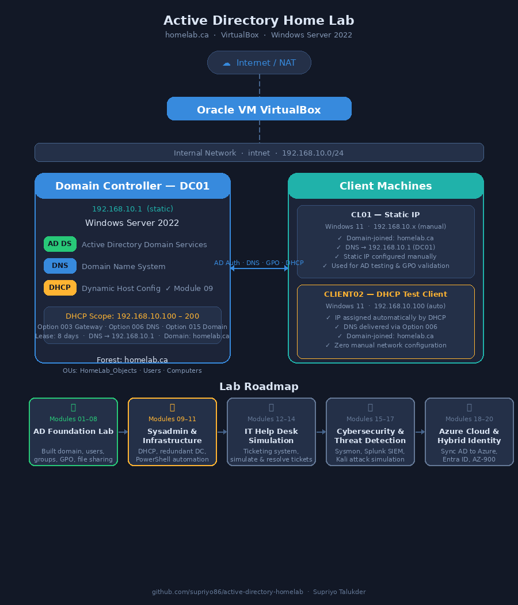

# 🧪 Active Directory Home Lab (Windows Server 2022)

<p align="center">
  
  
  
  
  
</p>

---

## 📌 Project Overview

This project documents the deployment and management of a **Windows Server 2022 Active Directory environment** built from scratch using **Oracle VM VirtualBox**.

The lab simulates a real-world enterprise network, progressing from a basic AD foundation through to sysadmin automation, cybersecurity monitoring, and Azure cloud integration.

📌 Built as hands-on experience for **IT Support / Help Desk / Sysadmin / Cybersecurity roles**

---

## 🏗️ Lab Architecture

<p align="center">
  
</p>

<p align="center"><b>Figure:</b> Active Directory Home Lab Architecture</p>

| Component | Details |
|---|---|
| Hypervisor | Oracle VM VirtualBox |
| Domain Controller | DC01 (Windows Server 2022) |
| Client Machines | CL01, CLIENT02 (Windows 11) |
| Domain | homelab.ca |
| Network | Internal Network (intnet) |
| Services | AD DS, DNS, DHCP |
| Tools | ADUC, GPMC, RSAT, PowerShell |

---

## 🗺️ Lab Roadmap

```
Foundation Lab (Modules 01–08) ✅
│
├── Phase 1 · Sysadmin Stack (Modules 09–11) 🔄
│   ├── 09 · DHCP Server ✅
│   ├── 10 · DC02 Replication ⬜
│   └── 11 · PowerShell Bulk Users ⬜
│
├── Phase 2 · Help Desk (Modules 12–14) ⬜
│   ├── 12 · Deploy osTicket
│   ├── 13 · Simulate Tickets
│   └── 14 · Resolve & Document
│
├── Phase 3 · Cybersecurity (Modules 15–17) ⬜
│   ├── 15 · Sysmon + DC Logging
│   ├── 16 · Splunk SIEM
│   └── 17 · Kali Brute-Force Simulation
│
└── Phase 4 · Azure Cloud (Modules 18–20) ⬜
    ├── 18 · Free Azure Tenant
    ├── 19 · AD Connect Sync
    └── 20 · AZ-900 Cert Prep
```

---

## 📂 Project Structure

```bash
active-directory-homelab/
│
├── 01-windows-server-installation/
├── 02-domain-controller-setup/
├── 03-client-domain-join/
├── 04-security-groups-and-access-control/
├── 05-delegation-of-control/
├── 06-shared-folder-permissions/
├── 07-mapping-network-drives-&-permission-testing/
├── 08-deploying-a-domain-wide-wallpaper/
├── 09-dhcp-server/
│
├── screenshots/
└── README.md
```

---

## 🚀 Lab Modules

### ✅ Foundation Lab — Modules 01–08

---

#### 🔹 [01 - Windows Server Installation](./01-windows-server-installation)
- Installed Windows Server 2022 on VirtualBox
- Troubleshot Unattended Installation error
- Completed successful deployment

---

#### 🔹 [02 - Domain Controller Setup](./02-domain-controller-setup)
- Installed AD DS and DNS
- Promoted server to Domain Controller
- Created new forest: homelab.ca

---

#### 🔹 [03 - Client Domain Join](./03-client-domain-join)
- Configured DNS to point to DC01
- Joined Windows 11 client (CL01) to domain
- Verified domain authentication

---

#### 🔹 [04 - Security Groups & Access Control](./04-security-groups-and-access-control)
- Created Security Groups (IT_Group, HR_Group, Employees_Group)
- Assigned users to groups
- Verified membership from both group and user side

---

#### 🔹 [05 - Delegation of Control](./05-delegation-of-control)
- Delegated password reset permissions to IT_Group
- Implemented Least Privilege (RBAC)
- Used RSAT for remote AD administration from CL01

---

#### 🔹 [06 - Shared Folder Permissions](./06-shared-folder-permissions)
- Configured NTFS and Share Permissions
- Implemented group-based access control
- Managed inheritance and removed default permissions

---

#### 🔹 [07 - Network Drive Mapping](./07-Mapping-Network-Drives-&-Permission-Testing)
- Mapped shared folder as Z: drive on CL01
- Tested access using IT Admin and HR user accounts
- Validated RBAC enforcement (HR: Read only, IT: Full Control)

---

#### 🔹 [08 - GPO Wallpaper Deployment](./08-Deploying-a-Domain-Wide-Wallpaper)
- Deployed domain-wide wallpaper via Group Policy
- Used UNC path for centralized image access
- Resolved NTFS permission black screen issue

---

### 🔄 Phase 1 — Sysadmin Stack

---

#### 🔹 [09 - DHCP Server](./09-dhcp-server) ✅
- Deployed DHCP Server role on DC01
- Authorised DHCP server in Active Directory
- Created scope: 192.168.10.100–200 with /24 subnet
- Configured Options 003 (gateway), 006 (DNS), 015 (domain)
- Verified automatic IP assignment on fresh Windows 11 client (CLIENT02)
- CLIENT02 joined homelab.ca domain using DHCP-delivered DNS settings

---

#### 🔹 10 - DC02 Second Domain Controller ⬜
- Spin up second Windows Server 2022 VM
- Promote as secondary domain controller
- Configure AD replication between DC01 and DC02
- Test failover — disable DC01 and confirm CL01 can still authenticate

---

#### 🔹 11 - PowerShell Bulk User Automation ⬜
- Write PowerShell script to bulk-create AD users from CSV
- Assign users to OUs and security groups
- Set initial passwords programmatically

---

## 🧠 Key Concepts Demonstrated

- Active Directory Domain Services (AD DS)
- DNS Configuration in Enterprise Networks
- DHCP Scope and Options (003, 006, 015)
- Organizational Units (OUs) and Group Policy
- Security Groups and Role-Based Access Control (RBAC)
- NTFS vs Share Permissions
- Group Policy Objects (GPO)
- Network Drive Mapping
- Least Privilege Principle
- Client-Server Communication

---

## 💼 Skills Demonstrated

- Windows Server 2022 Administration
- Active Directory Management
- DHCP Server Deployment and Configuration
- User and Group Administration
- Access Control Implementation
- Group Policy Management
- Troubleshooting and Root Cause Analysis
- Virtualization (VirtualBox)
- PowerShell (upcoming)
- Documentation and IT Workflow

---

## 🎯 Current Outcome

✔ Built a fully functional Active Directory environment from scratch  
✔ Deployed DHCP server — clients receive IP, DNS, and domain config automatically  
✔ Simulated real-world enterprise IT infrastructure  
✔ Implemented secure access control mechanisms  
✔ Demonstrated hands-on sysadmin skills across 9 modules  

---

## 👨‍💻 Author

**Supriyo Talukder**  
Aspiring IT Support / Sysadmin / Cybersecurity Professional  
[GitHub](https://github.com/supriyo86) · [LinkedIn](https://www.linkedin.com/in/supriyo-talukder-3291042a6/)

---

## ⭐ Final Note

This project showcases practical, hands-on experience in **Active Directory, system administration, and enterprise IT environments**, making it directly relevant for entry-level IT Support, Sysadmin, and Cybersecurity roles.
